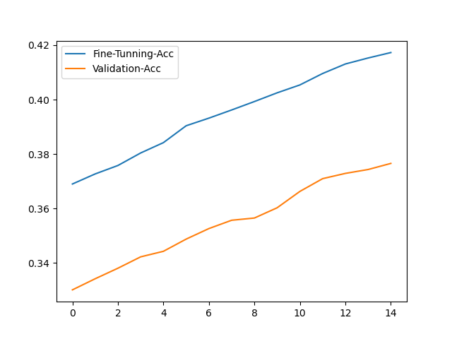
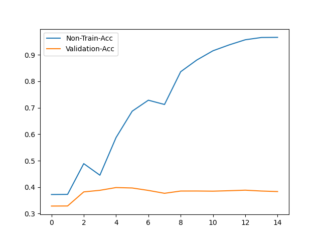
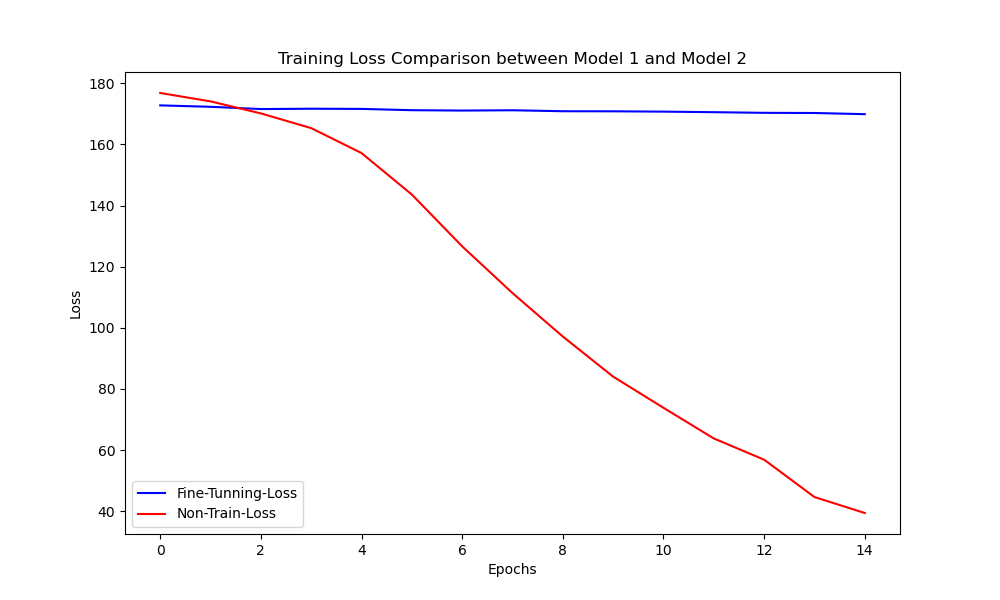

# 어떤 task를 선택하셨나요 ?
MNLI task를 선택하여 두 문장의 전제와 가설의 관계를 학습하는 task를 선택하였습니다.
colab gpu 세션이 활성화가 되지 않아 loss 출력 로그와 그래프를 readme에 포함하였습니다.

# 모델은 어떻게 설계하셨나요 ? 설계한 모델의 입력과 출력 형태가 어떻게 되나요 ?
모델의 입력은 pre-trained된 distilbert encoder를 그대로 사용하였습니다.
출력 형태는 encoder의 마지막 hidden 계층을 가져와 dropout -> Linear로 출력되도록 하였습니다.

# 어떤 pred-trained 모델을 활용하였나요 ?
distilbert 모델을 사용하였습니다.

# 실제로 pre-trained 모델을 fine-tuning했을 때 loss curve은 어떻게 그려지나요? 그리고 pre-train 하지 않은 Transformer를 학습했을 때와 어떤 차이가 있나요?
loss curve는 아래 그래프와 같이 전반적으로 느리게 loss가 내려 갑니다.
Validation 정확도가 느리게 올라가긴 하지만 계속 증가합니다.

non-train model은 오히려 loss가 가파르게 내려 갑니다.
Validation 정확도가 지속적으로 증가하지 않고 정체되는 현상이 있습니다.
non-train의 train 정확도는 높지만, validation 정확도는 정체 현상이 있는 걸로 보아서 과적합 현상이 나타는걸로 보입니다.

## fine-tuning 모델의 loss:

Epoch   0 | Train Loss: 172.8003876209259  
=========> Train acc: 0.369 | Validation acc: 0.330  
Epoch   1 | Train Loss: 172.33213996887207  
=========> Train acc: 0.373 | Validation acc: 0.334  
Epoch   2 | Train Loss: 171.5929102897644  
=========> Train acc: 0.376 | Validation acc: 0.338  
Epoch   3 | Train Loss: 171.70208942890167  
=========> Train acc: 0.380 | Validation acc: 0.342  
Epoch   4 | Train Loss: 171.64195239543915  
=========> Train acc: 0.384 | Validation acc: 0.344  
Epoch   5 | Train Loss: 171.2211138010025  
=========> Train acc: 0.390 | Validation acc: 0.349  
Epoch   6 | Train Loss: 171.10193407535553  
=========> Train acc: 0.393 | Validation acc: 0.353  
Epoch   7 | Train Loss: 171.19725096225739  
=========> Train acc: 0.396 | Validation acc: 0.356  
Epoch   8 | Train Loss: 170.8823984861374  
=========> Train acc: 0.399 | Validation acc: 0.356  
Epoch   9 | Train Loss: 170.85794579982758  
=========> Train acc: 0.403 | Validation acc: 0.360  
Epoch  10 | Train Loss: 170.75192999839783  
=========> Train acc: 0.405 | Validation acc: 0.366  
Epoch  11 | Train Loss: 170.57002580165863  
=========> Train acc: 0.410 | Validation acc: 0.371  
Epoch  12 | Train Loss: 170.35893845558167  
=========> Train acc: 0.413 | Validation acc: 0.373  
Epoch  13 | Train Loss: 170.30317437648773  
=========> Train acc: 0.415 | Validation acc: 0.374  
Epoch  14 | Train Loss: 169.92443323135376  

## non-traiend 모델의 loss:

Epoch   0 | Train Loss: 176.84764325618744  
=========> Train acc: 0.372 | Validation acc: 0.328  
Epoch   1 | Train Loss: 174.1078760623932  
=========> Train acc: 0.373 | Validation acc: 0.329  
Epoch   2 | Train Loss: 170.172897875309  
=========> Train acc: 0.489 | Validation acc: 0.382  
Epoch   3 | Train Loss: 165.35199791193008  
=========> Train acc: 0.445 | Validation acc: 0.388  
Epoch   4 | Train Loss: 157.18973088264465  
=========> Train acc: 0.587 | Validation acc: 0.398  
Epoch   5 | Train Loss: 143.61727118492126  
=========> Train acc: 0.687 | Validation acc: 0.397  
Epoch   6 | Train Loss: 126.67167085409164  
=========> Train acc: 0.729 | Validation acc: 0.388  
Epoch   7 | Train Loss: 111.3766759634018  
=========> Train acc: 0.712 | Validation acc: 0.377  
Epoch   8 | Train Loss: 97.14914253354073  
=========> Train acc: 0.836 | Validation acc: 0.385  
Epoch   9 | Train Loss: 84.03152874112129  
=========> Train acc: 0.880 | Validation acc: 0.385  
Epoch  10 | Train Loss: 73.83540481328964  
=========> Train acc: 0.915 | Validation acc: 0.385  
Epoch  11 | Train Loss: 63.80525693297386  
=========> Train acc: 0.938 | Validation acc: 0.386  
Epoch  12 | Train Loss: 56.85472533106804  
=========> Train acc: 0.957 | Validation acc: 0.388  
Epoch  13 | Train Loss: 44.635396398603916  
=========> Train acc: 0.966 | Validation acc: 0.385  
Epoch  14 | Train Loss: 39.41175174713135  
=========> Train acc: 0.966 | Validation acc: 0.383  

## Fine-tuning 모델의 정확도 비교

## Non-traind 모델의 정확도 비교

## Fine-tuning과 Non-traind 모델의 loss 비교
